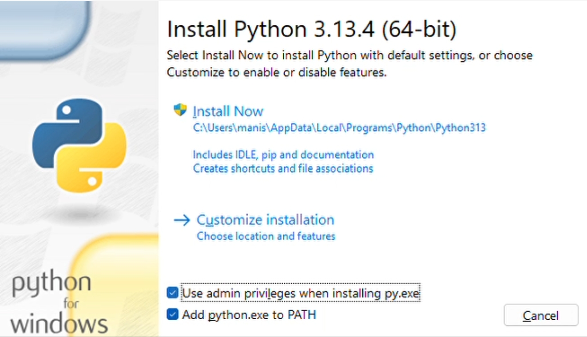

# SimCricketX 🏏

SimCricketX is a Python Flask-based web application that simulates T20 cricket matches with ball-by-ball commentary. Users can create custom teams, manage players, and experience realistic match dynamics with live updates and statistics.

---

## 🚀 What We've Built

SimCricketX is a full-featured cricket simulation platform that transforms the traditional cricket gaming experience by combining realistic match dynamics with web-based deployment.

---

## ⚙️ Key Features & Capabilities

### 🔁 Authentic Cricket Simulation Engine
- **Realistic Match Dynamics**: Ball-by-ball simulation considering pitch, skills, and context
- **Full T20 Format**: 20-over matches with bowling restrictions and strategy
- **Weather Integration**: Rain with simplified DLS rules
- **Super Over Support**: Auto tie-breaker via super over gameplay

### 🧢 Comprehensive Team Management
- **Custom Teams**: Create teams with 15–18 players
- **Detailed Player Profiles**: Batting, bowling, and special skills included
- **Strategic Setup**: Choose captain, keeper, and playing XI
- **Visual Branding**: Customize team colors and identity

### 📢 Immersive Match Experience
- **Interactive Setup**: Coin toss, pitch selection, and team choices
- **Live Commentary**: Real-time dynamic ball-by-ball updates
- **Advanced Stats**: Live scorecards, player performance, and match analytics
- **Viewing Modes**: Switch between scoreboard, summary, and deep stats

### 📊 Data & Analytics
- **Match Reports**: Auto-generated in HTML, CSV, JSON, and TXT
- **History & Archive**: Searchable match history and data logs
- **Performance Insights**: Player and match-level performance tracking

### 🖥️ Modern UX
- **6 Visual Themes**: Nord, Retro, Cupcake, Dim, Dracula, Sunset
- **Responsive UI**: Desktop, tablet, and mobile support
- **Dark/Light Mode**: Auto theme persistence
- **Intuitive UX**: Drag-and-drop and easy navigation

---

## 🛠️ Technical Achievements

### 🧠 Advanced Simulation
- **Bowling AI**: Fatigue-aware, situation-sensitive bowling logic
- **Pitch Types**: Green, Flat, Dry, Hard, Dead - each affects outcomes
- **Probability Engine**: Skill + situation = dynamic result generation

### 🗃 Robust Data Management
- **Secure Auth System**: Login and access control
- **Optimized Storage**: File-based management with auto-cleanup
- **Export-Ready**: Archive in multiple formats automatically

### ⚡ Performance & Reliability
- **Scalable Design**: Modular backend with support for multiple users
- **Error Resilience**: Input validation and fail-safe execution
- **Smart Resource Use**: Optimized memory and disk usage

---

## 🧩 Installation

### 1️⃣ Install Python

Download Python from: [https://www.python.org/downloads/](https://www.python.org/downloads/)  
During installation, make sure to **check the box**: `Add Python to PATH`.

---

### 2️⃣ Download and Set Up Project

1. Go to the GitHub repository.
2. Click on **Code > Download ZIP**.
3. Extract the ZIP to any folder of your choice.

---

### 3️⃣ Run the App

- Navigate to the extracted folder.
- Double-click on `run.bat` file to launch the app.

---

### 4️⃣ Access the Web App

Open your browser and visit:
- `http://127.0.0.1:7860`  
  _or_  
- `http://192.168.254.131:7860` (for LAN access)

---

## 🤝 Contributing

Interested in contributing? Raise an issue or submit a pull request!

---

## 📄 License

MIT License. See `LICENSE` file for details.

---

## 🙌 Credits

Built with ❤️ using Flask, HTML/CSS/JS, and cricket fandom.

---

